# Cornix 日本語マニュアル（保存コピー）

- **出典 (Source)**: <https://docs.channel.io/jezailfunderjp/ja/articles/Cornix-%E6%97%A5%E6%9C%AC%E8%AA%9E%E3%83%9E%E3%83%8B%E3%83%A5%E3%82%A2%E3%83%AB-c1160246>
- **製造元 (Vendor)**: 鍵造坊（JezailFunder）
- **取得日 (Retrieved)**: 2026-05-27
- **備考**: 公式マニュアル（stock RMK + Vial 前提）のオフライン参照用コピー。最新情報は必ず上記URLを確認してください。本リポジトリのファームウェアは ZMK へ置き換えるため、キーマップ操作（Vial）部分は本リポジトリの構成とは異なります。

---

## Cornix ワイヤレス分割型キーボード

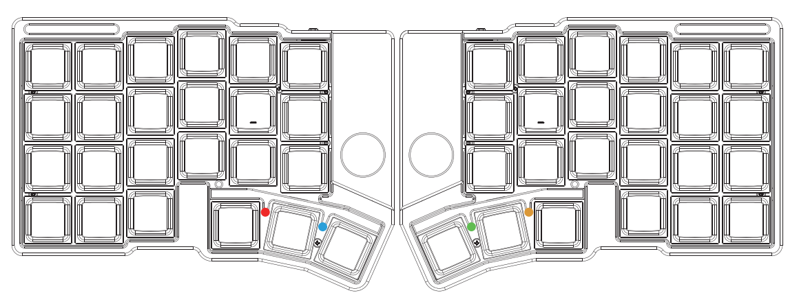

Cornix は、鍵造坊（JezailFunder）によって開発された完全ワイヤレス分割型エルゴノミクスキーボード。

### 主な特長

- 完全ワイヤレス分割設計 — 左右ユニット間と本体・通信モジュール間がすべてワイヤレス接続
- デュアルモード接続 — Bluetooth および USB 有線接続に対応
- 高度なカスタマイズ機能 — マクロ、ホームポジション修飾キー、コンボなどをサポート
- RGB インジケーター — 左右に2つのRGBインジケーターで接続・動作状態を表示

## 充電

- **電源の入れ方**: キーボード正面のスイッチを「左」でオン、「右」でオフ
- ⚠️ 充電中も電源をオンにしておく必要がある
- ⚠️ 高速充電器・高出力アダプタは故障の原因になるため、可能な限り PC から充電
- 満充電後はケーブルを抜き、長時間つなぎっぱなしを避ける
- **ファームウェアバージョン確認**: Vial 画面の「Keyboard Layout」から確認可能。v1.11 以降の適用を推奨

## 左手側インジケーターライト

### 左側ライト（Bluetooth インジケーター）

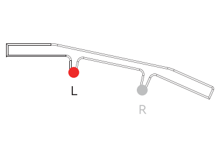

- 緑/赤/青 = Bluetooth チャンネル 0/1/2 に対応
- ゆっくり点滅 = Bluetooth デバイス検索中
- 一度点灯後消灯 = Bluetooth 接続完了

### 右側ライト（ユニット接続・バッテリーインジケーター）

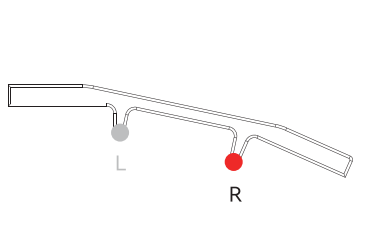

- 赤色点滅 = バッテリー残量少
- 緑色ゆっくり点滅 = 充電中
- 緑色点灯後消灯 = 充電完了
- 青色ゆっくり点滅 = 右手ユニット接続喪失
- 青色点灯後消灯 = 右手ユニット接続成功

## 右手側インジケーターライト

### 左側ライト（バッテリーインジケーター）

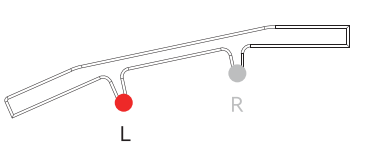

- 赤色点滅 = バッテリー残量少
- 緑色ゆっくり点滅 = 充電中
- 緑色点灯後消灯 = 充電完了

### 右側ライト（左右ユニット接続インジケーター）

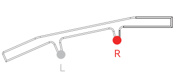

- 青色ゆっくり点滅 = 左手ユニット接続喪失
- 青色点灯後消灯 = 左手ユニット接続成功

## キーリマップ変更

Cornix は有線・無線モード両方で Vial によるキーマップ変更に対応。

- **初期キーマップ**: `cornix-default-keymap.vil`（8.6KB）。Vial アプリ版で「File → Load saved layout」からインポート可能。

### キーマップ変更手順

1. **Vial サイトを開く**: <https://vial.rocks>
2. **デバイスを選択して接続**: 「Start Vial」→ ポップアップから選択して「接続」
   - 有線モード時: `Cornix`
   - 無線モード時（macOS）: `Cornix - ペア設定済み`
   - 無線モード時（Windows）: `不明なデバイス（0000:0000）`
   - ⚠️ 無線は電波干渉で接続エラーの場合あり。失敗時は有線モードへ切り替え推奨
   - エラー対応: ブラウザ再起動＋Vial再読込 / 電源オフ→オン / それでも不可なら左手ユニットをUSB接続して有線で操作
3. **キーマップをカスタマイズ**: 接続後、設定画面で自由に変更可能

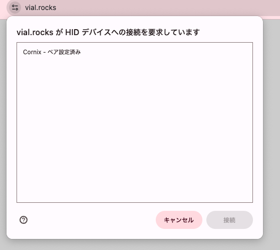

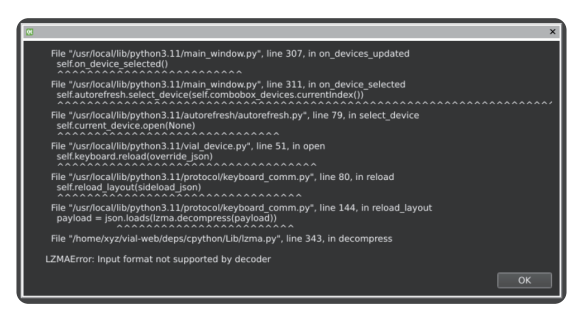

## 接続方法

最大3台の Bluetooth デバイスと有線 USB 接続に対応。

- **USB接続（有線モード）**: 左手ユニットを USB ケーブルで PC に接続
- **Bluetooth接続（無線モード）**: 最大3台（BT0/BT1/BT2）

### Bluetooth デバイス切り替え方法

- Vial「User」タブで BT0/BT1/BT2 を任意キーに割り当て
- 初期設定: `MO(3)` を押しながら Caps/Shift/Ctrl で切り替え

### 接続優先モード

- **USB優先モード（初期設定）**: USB 接続時は自動で USB モードへ。Bluetooth は無効
- **Bluetooth優先モード**: Bluetooth を優先。USB 接続時は充電のみ。Bluetooth 未接続時に USB 接続した場合のみ有線が有効
- **切り替え方法**: Vial「User」タブで「Switch Output」を任意キーに割り当て、押下で切り替え

## デバイスのスリープ

一定時間操作がないと自動でスリープへ移行。

- **接続済みデバイスがある場合**: スリープ中も接続を維持。復帰後もキー入力が失われない
- **ペアリング待機（ブロードキャスト）状態の場合**: 復帰には任意キー押下が必要。復帰後、デバイス側から再検索・接続

### 自動ペアリング

- 初回起動時に左右ユニットが自動ペアリング（手動設定不要）
- 一度成功すると、電源投入時に自動で再接続

### ペアリング解除

1. Vial 起動 →「User」タブ
2. 任意キーに「Clear Peer」を割り当て
3. 「Clear Peer」キーを **8秒以上長押し**で解除
4. **再起動（重要）**: 自動再ペアリング防止のため、USB 解除 → 電源オフ → 3秒待って再度オン

### 再ペアリング

再起動後、解除された左右ユニットは起動時に自動で検索モードに入り、自動的に再ペアリングされる。

## ファームウェア更新

最新ファームウェアは Cornix ファームウェアページからダウンロード可能。

- ⚠️ 左右キーボード両方の更新が必要
- ⚠️ バージョンをまたぐ更新で既存キーリマップ設定が消去されるため、更新前にバックアップ必須

### キーマップ設定のバックアップ

- ファームウェア更新で既存のキーマップ設定はすべて初期化される
- **バックアップ**: Vial で「File → Save current layout」
- **復元**: 更新後「File → Load saved layout」

### 更新前の準備

1. **Bluetoothペアリング解除**: PC の Bluetooth 設定から Cornix のペアリングを事前削除（更新でペアリング情報がリセットされるため必須）
2. **ファームウェアとツール準備**: 最新 Cornix ファームウェア（左手用/右手用を PC に保存）、ピンセットや SIM ピン等の細いツール

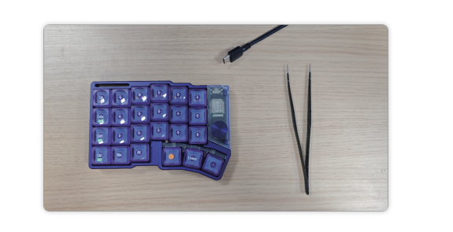

### ファームウェア更新手順

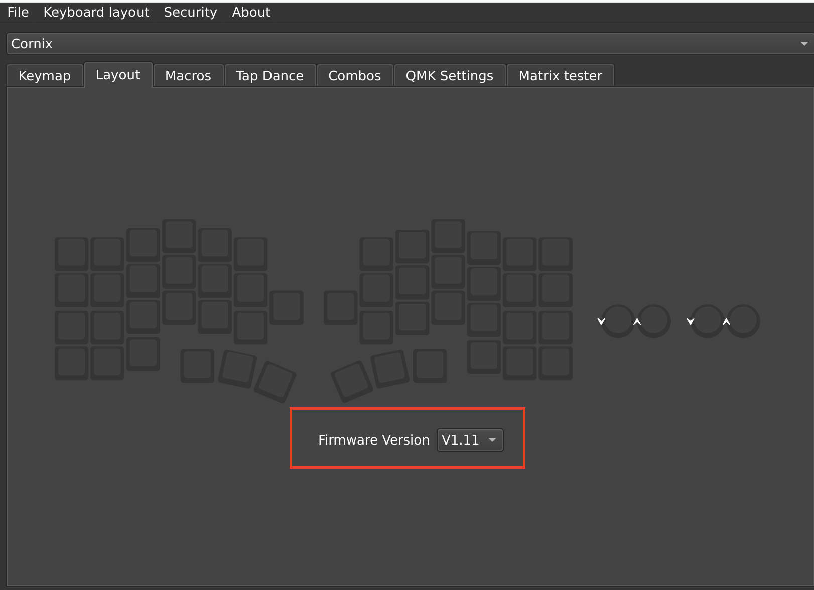

#### ブートモードに入る

1. キーボードを USB ケーブルで PC に接続
2. ピンセット等でリセットボタンをすばやく2回押す
3. PC 上に「Cornix」または「NO NAME」という USB ドライブが表示
4. 左右キーボード各々で同じ操作を実行

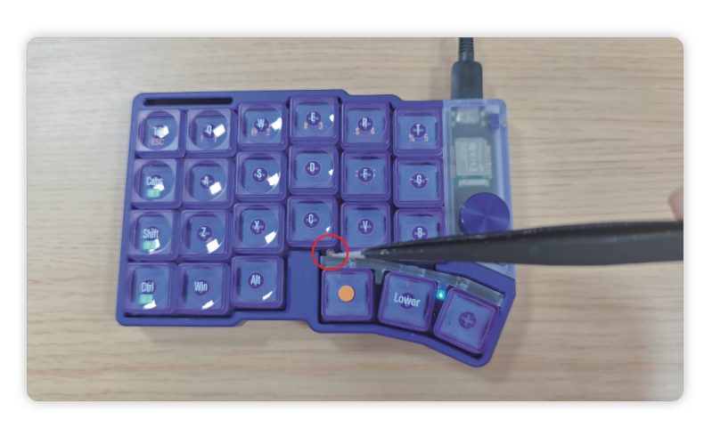

#### ファームウェアを書き込む

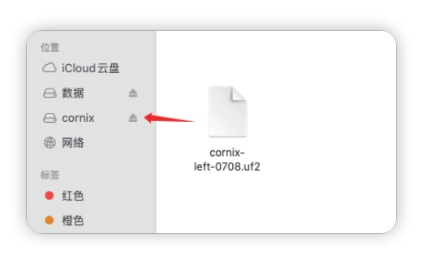

- 準備した UF2 ファイルを表示された USB ドライブへドラッグ&ドロップ
  - 左手ユニット用: `left`
  - 右手ユニット用: `right`
- コピー完了で書き込み完了
- ⚠️ ファイル転送やディスク取り出しエラーが表示されることがあるが、再起動による一時的な挙動のため通常は無視して問題なし
- 更新完了後、Vial の Layout タブでバージョン確認可能

#### 再ペアリング

左右両キーボードで同様操作後、自動的に再ペアリングが実行される（特別な操作不要）。
